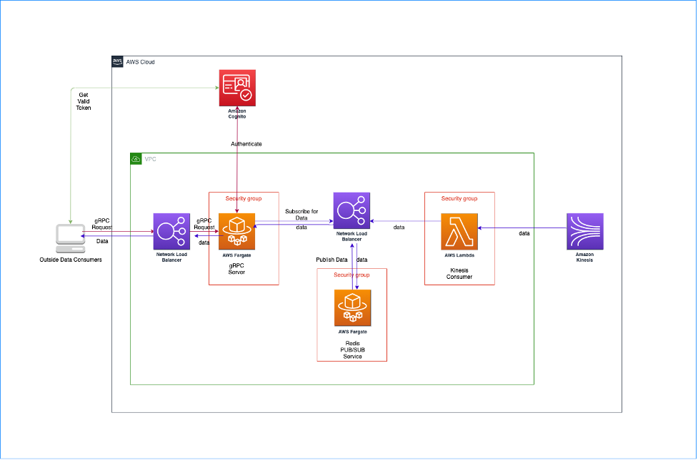
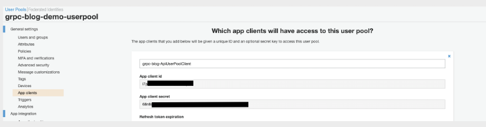
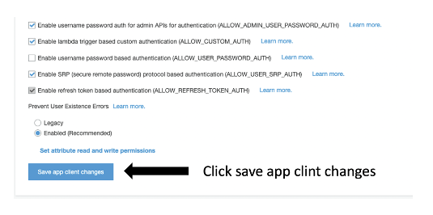
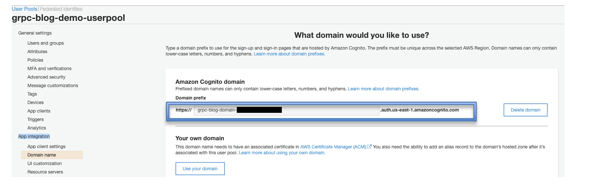
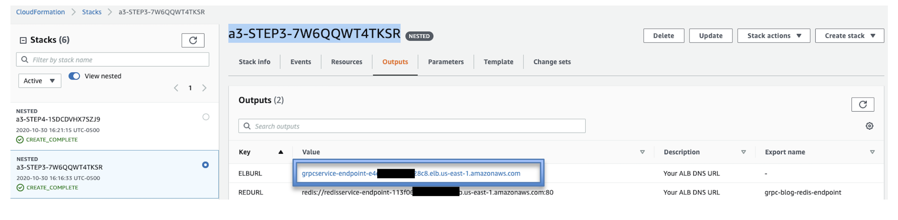

# Stream data from Amazon Kinesis to users outside AWS in real-time using Amazon Lambda, Redis and gRPC

Many organizations are generating real time data from numerous sources such as IOT devices, point of sale transactions, application logs etc. AWS provides different services such as Amazon Kinesis streams, Amazon MSK and Amazon Kinesis Firehose to capture this streaming data in real time. This blog talks about a use case where this data captured through one those services (kinesis streams) needs to be streamed/ forwarded to the users outside AWS in real time.

For example, let&#39;s say organization ABC Inc. is a leading weather data aggregator company who receives real time weather data from different IOT devices all over the world. ABC uses Amazon Kinesis Data Streams to capture this data. Now, ABC has different customers such as local News channels and they only need data for certain States in real time, another customer such as some research institute who need data for the entire country in real time etc. In this blog we will handle this use case to show how we can achieve data forwarding from Kinesis to users in real time who are outside AWS and do not have an AWS account.

We will make use of Amazon lambda as a consumer to consume the data from kinesis. We will be using gRPC as it supports server streaming. This feature would be useful as we want to stream the data in real time to outside data consumers. The second open source technology we would be using is Redis, we would be using the PUB/SUB feature of Redis. The gRPC server and Redis server would be hosted on the AWS Fargate behind the network load balancers. The Redis service would act as a buffer between the lambda consumer and gRPC server as shown in the architecture diagram. The authentication of the requests would be handled by Amazon Cognito.

# **Solution Overview**

The steps we will follow in this blog post are:

1.Create a Virtual Private Cloud (VPC)

2.Provision an App Client in Amazon Cognito service (which would be used for Authentication Token)

3.Create ECS Fargate service for gRPC server and for redis server

4.Create a Kinesis data stream and a lambda function which would consume data from kinesis.

# **Prerequisites and assumptions**

To follow the steps outlined in this blog post, you need the following:

● An AWS account that provides access to AWS services.

● The templates and code are intended to work in the US-EAST-1 region only and they are only for

demonstration purpose only and not for production use.

Additionally, be aware of the following:

● We configure all services in the same VPC to simplify networking considerations.

● **Important** : The [AWS CloudFormation](https://aws.amazon.com/cloudformation/) templates and the sample code that we provide use

hard-coded usernames and passwords and open security groups. These are just for testing

purposes and aren&#39;t intended for production use without any modifications.

# **Implementing the solution**

You can use this [downloadable template](./grpc-kinesis-blog/cloudformation/all_steps.yaml) for single-click deployment. This template is launched in the US East (N. Virginia) Region by default. Do not change to a different Region. The template is designed to work only in the US East (N. Virginia) Region. To launch directly through the console, choose the Launch Stack button.

{width="1.3211001749781277in"
height="0.24770559930008748in"}

**1. Use the AWS CloudFormation template to configure Amazon VPC**

In this step, we set up a VPC, public subnet, internet gateway, route table, and a security group. The security group has one inbound access rule. The inbound rule allows access to any TCP port from any host within the same security group. We use this VPC and subnet for all other services that are created in the next steps.

You can use this downloadable AWS CloudFormation [template](./grpc-kinesis-blog/cloudformation/step-1-vpc) to set up the previous components. To launch directly through the console, choose Launch Stack.

This template takes the following parameters. The following table provides additional details.

| Parameter | Take this action |
| --- | --- |
| StackName | Provide any custom stackName -ex: step-1-aws-grpc-blog-vpc |

After you specify the template details, choose Next. On the Review page, choose Create.

When the stack launch is complete, it should return outputs similar to the following.

| VPCID | vpc-xxxxxxxx |
| --- | --- |
| SubnetID | subnet-xxxxxxxx |
| SecurityGroup | sg-xxxxxxxxxxx |

**2. Use the AWS CloudFormation template to create an App Client in Amazon Cognito service**

In this step, we will be creating the Amazon Cognito user pool and an app client in that user pool. For more information on how to create a Cognito app client, please check this [link](https://docs.aws.amazon.com/cognito/latest/developerguide/cognito-user-pools-app-idp-settings.html). You can use this[downloadable](./grpc-kinesis-blog/cloudformation/step-2-cognito) AWS CloudFormation template to set up the previous components. To launch directly through the console, choose Launch Stack.

This template takes the following parameters. The following table provides additional details.

| Parameter | Take this action |
| --- | --- |
| StackName | Provide any custom stackName -ex: step-2-aws-grpc-blog-cognito |

After you specify the template details, choose Next. On the Review page, choose Create.

When the stack launch is complete, it should return outputs similar to the following.

| Key | Value |
| --- | --- |
| UserPoolClientId | xxxxxxxxxxxxxxxxxxx |
| UserPoolEndpoint | https://cognito-idp.us-east-1.amazonaws.com/\&lt;UserPoolId\&gt; |
| DomainEndpoint | [https://grpc-blog-domain-xxxxxxxxxxxx.auth.us-east-1.amazoncognito.com/oauth2/token](https://grpc-blog-domain-005433150253a94fe.auth.us-east-1.amazoncognito.com/oauth2/token) |

**3. Use the AWS CloudFormation template to create services in Amazon ECS cluster**

In this step, we will be creating an Amazon ECS cluster with two services running on AWS Fargate containers. The first service will be hosting a gRPC server, this server will be responsible for accepting the connections from the outside clients, authenticating them using the Cognito token and sending the data. The second service will be hosting a redis server. This server will work as a buffer between kinesis consumer lambda and gRPC server.

You can use this [downloadable](./grpc-kinesis-blog/cloudformation/step-3-ecs) AWS CloudFormation template to set up the previous components. To launch directly through the console, choose Launch Stack.

This template takes the following parameters. The following table provides additional details.

| Parameter | Take this action |
| --- | --- |
| StackName | Provide any custom stackName -ex: step-3-aws-grpc-blog-ecs |

After you specify the template details, choose Next. On the options page, choose Next again. On the Review page select &quot;I acknowledge that AWS CloudFormation might create IAM resources with custom names&quot; option and click the Create button.

When the stack launch is complete, it should return outputs similar to the following.

| Key | Value |
| --- | --- |
| ELBURL | grpcservice-endpoint-xxxx.elb.us-east-1.amazonaws.com |
| REDURL | redis://redisservice-endpoint-xxx.elb.us-east-1.amazonaws.com:80 |

Make a note of the output, because you use this ELBURL while connecting to the server. You can view the stack outputs on the AWS Management Console or by using the following AWS CLI command:

**$ aws cloudformation describe-stacks --stack-name \&lt;stack\_name\&gt; --region us-east-1 --query &#39;Stacks[0].Outputs&#39;**

### **4. Use the AWS CloudFormation template to create Amazon Kinesis Data Stream and a consumer Lambda function and sample**

In this step, we will be creating an Amazon Kinesis Data stream. Which we would be using to put sample data for this blog. After creating the data stream, we would be creating a Lambda function. This lambda function will act as a Kinesis consumer which would consume the real time data and deliver it to the Redis server which would then send it to appropriate gRPC client.

You can use this[downloadable](./grpc-kinesis-blog/cloudformation/step-4-lambda) AWS CloudFormation template to set up the previous components. To launch directly through the console, choose Launch Stack.

This template takes the following parameters. The following table provides additional details.

| Parameter | Take this action |
| --- | --- |
| StackName | Provide any custom stackName -ex: step-4-aws-grpc-blog-lambda |
| LambdaFunctionName | Select from the dropdown |

After you specify the template details, choose Next. On the options page, choose Next again. On the Review page select &quot;I acknowledge that AWS CloudFormation might create IAM resources with custom names&quot; option and click the Create button.

When the stack launch is complete, it should return outputs similar to the following.

| Key | Value |
| --- | --- |
| KinesisStreamArn | arn:aws:kinesis:us-east-1:xxxxx:stream/grpc-blog-kinesis-stream |

Make a note of the output, because we will use this Kinesis Stream for putting the sample data. You can view the stack outputs on the AWS Management Console or by using the following AWS CLI command:

**$ aws cloudformation describe-stacks --stack-name \&lt;stack\_name\&gt; --region us-east-1 --query &#39;Stacks[0].Outputs&#39;**

# **Executing the solution**

Now that all the resources are created and ready, we can execute the solution with following steps-

**Step 1: Download and Configure the Client**

As this is a gRPC application we would need a special client to connect to the application. For the demo you can download the client from the following S3 location:
    **aws s3 sync  aws-s3-bucket local-bucket

Once the client is downloaded navigate to the folder where you have the client on your machine, it would have three files
- grpc-client-module-1.0-SNAPSHOT-jar-with-dependencies.jar
- grpc-client-cli

- properties.yaml

Before we can use the client we would need to configure the properties.yaml. In this file we need to populate following values

    1. clientId : &quot;l7p1XXXXXXXXXXXX&quot;
    2. clientSecret : &quot;XXXXXXXXXXXX44b02c7vlvkbv5nXXXXXXXXXXXX&quot;

These two values can be found under the AWS cognito → grpc-blog-demo-userpool → App clients. Following image shows where we can find these credentials:

Note: Before moving to the next steps, scroll down on App Clients page and click on &quot; **save app client changes**&quot; shown below, as without that you may not be able to get the token:

    3. tokenUrl : &quot;https://grpc-blog-domain-XXX4482a9XXXXXX.auth.us-east-1.amazoncognito.com/oauth2/token&quot;

This can be found under AWS Cognito → grpc-blog-demo-userpool → App integration → Domain name as shown in following image:

Note: Please copy the entire link i.e. from &quot;https://&quot; till &quot;amazoncognito.com&quot; and then append &quot;/oauth2/token&quot; at the end. Your tokenUrl should look like following:

&quot; **https://grpc-blog-domain-XXX4482a9XXXXXX.auth.us-east-1.amazoncognito.com/oauth2/token&quot;**

1. serviceEndpoint: &quot;grpcservice-endpoint-XXXd5edaXXXX.elb.us-east-1.amazonaws.com&quot;

The service endpoint can be found under outputs of 3 rd cloudformation test . You can get that by using the following command and copying value for key names &quot;ELBURL&quot;

**$ aws cloudformation describe-stacks --stack-name \&lt;stack\_name\&gt; --region us-east-1 --query &#39;Stacks[0].Outputs&#39;**

We can also copy the value for key &quot;ELBURL&quot; from AWS console cloudformation outputs as shown in following image:

**Step 2: Running the Client**

Once all four variables in &quot;Properties.yaml&quot; are set we can run the client using the &quot;grpc-client-cli&quot; which is a python executable file which would run the client jar.

In order to run the client, navigate to the client folder on your terminal and run following command:

**./grpc-client-cli --api-action start-stream**

If you see **permission denied: ./grpc-client-cli** error

change the permission of grpc-client-cli using following command

**chmod +x grpc-client-cli**

This will start the stream of messages. Please note that you may have to install the &quot;pyyaml&quot; python package if it&#39;s not available already. You can use following command for the same:

**pip install pyyaml**

### **Step 3: Producing sample data**
In order to test end-to-end we would need to put some data records into your newly created kinesis stream. There are many ways to put records in Kinesis stream. For example, if you have cli setup, you can use following command to put record:

**aws kinesis put-record --stream-name grpc-blog-kinesis-stream --partition-key 123 --data testdata**

More information on CLI commands for generating the data can be found here:

[https://docs.aws.amazon.com/kinesis/latest/APIReference/API\_PutRecord.html](https://docs.aws.amazon.com/kinesis/latest/APIReference/API_PutRecord.html)

We can also use this Kinesis Data Generator to generate constant stream of data:
[https://aws.amazon.com/blogs/big-data/test-your-streaming-data-solution-with-the-new-amazon-kinesis-data-generator/](https://aws.amazon.com/blogs/big-data/test-your-streaming-data-solution-with-the-new-amazon-kinesis-data-generator/)

# **Scaling the solution**

In order to handle the higher number of records or users we would need to scale the solution. In this section we would discuss how we can scale the solution for handling the higher demand.
Kinesis stream: Kinesis data stream can be scaled by adding more shards for increasing the records/second capacity of incoming records.

Lambda: The lambda will scale automatically, and we do not need to worry about scaling the lambada.

Redis Servers: For this demo we are using a single instance of the Redis server. In order to scale the Redis server we would need to run the Redis in cluster mode and as we are using AWS Fargate to run the Redis servers, we can scale them by increasing the number of tasks.

gRPC Servers: In order to scale gRPC servers to handle more connections we would need to increase the number of tasks.

# **Securing the solution**
In this demo for securing the application we are using the Cognito authentication. Every time before connecting we get the temporary token from the AWS Cognito. This token is validated at the gRPC server and if the token is valid, we send the data. In addition to that we can also use SSL certificates in order to secure the data in transit. This demo solution does not provide the steps for SSL.

# **Conclusion:**

In this blog post, we went through an overview of a solution for creating a streaming application which can stream real-time data from kinesis data stream to the consumers outside of AWS. This blog also explained how we can use Cognito tokens to authenticate the incoming request. We also discussed how we can scale this application in order to handle higher volumes of data and connections. The same solutions can also be modified to forward streaming data from other sources such as AWS Managed Streaming Kafka.
